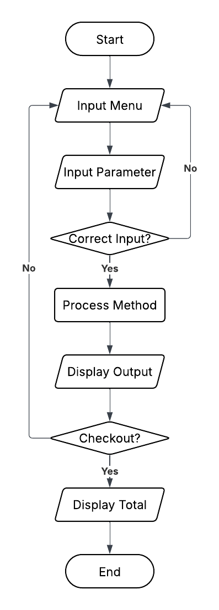

# Python Project : Super Cashier App

### A. Background

Andi is the owner of a large supermarket in one of Indonesia’s major cities. To improve his business operations, he plans to implement a **self-service cashier system** that allows customers to directly input purchased items, their quantity, and price  without needing a traditional cashier.

### B. Tools

Languages :
* Python

Libraries :
* Tabulate

### C. Objective

Learning objective :
* Create simple app using python for a real-world business use case
* Demonstrate the use of **Object-Oriented Programming** in Python
* Apply PEP8 principles to write clean Python program

Program objective :
* Simulate cashier system that enables item input, order summary, and total calculation
* Provide basic features such as updating and deleting items, applying coupon, and calculating discount

### D. Program Description
1. 'transaction.py' module contains Transaction class to handle the transaction process, with methods to add item to shopping cart, update item (name, quantity, and price), remove item (specific or all item), check cart contents, apply discount coupon, and calculate the total price of items in the cart.
2. 'cashier_app.py' module displays simple cashier app menu that allows user add their transaction by input action.

### E. Guide to Replicate
1. Download zip or clone this repository to local
2. Run cashier_app.py on terminal

### F. Test Cases and Result
1. Adding item to cart

2. Updating cart item name

3. Updating cart item quantity

4. Updating cart item price

5. Remove item from cart

6. Reset cart item

7. Check shopping cart

8. Checkout

### G. Conclusion
This project demonstrated how Python and OOP can help solving real world task. To further improve the application and simulate better app that fits user's need, there are several improvement I would like to do if I had the time and resources. Firstly, I would like to be able to save the transactions to database (e.g. SQLite/PostgreSQL) and be able to get report of daily transaction as a summary. I would also like to build a web framework using Django/Flask to improve the interface.